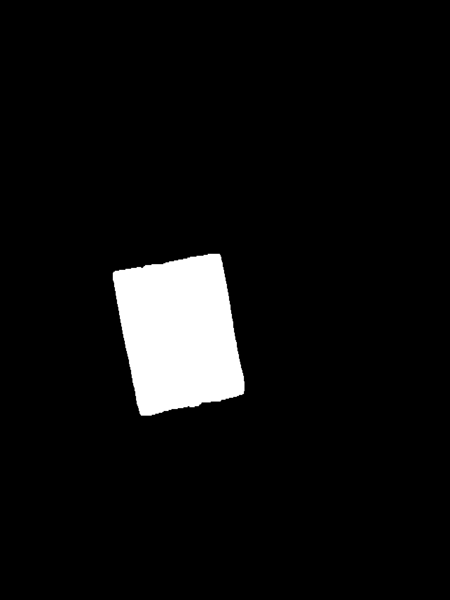

# EyeBin: AI-Powered Waste Management & Container Fill Level Detection System

EyeBin is an automated smart waste management system that utilizes Deep Learning and Computer Vision models to estimate container fill levels in real-time. By accurately detecting fill percentages using pixel-level segmentation, EyeBin optimizes municipal waste collection routes and reduces operational costs.

# Project Overview

Traditional waste collection methods rely on fixed schedules rather than actual container fullness, leading to unnecessary fuel consumption, overflow of waste, and environmental pollution. **EyeBin** solves this by automating fill-level assessment using computer vision models.

* **Target Application:** Smart City Infrastructure & Automated Route Optimization.
* **Core Models:** DeepLabV3+, U-Net, and YOLOv8 (Segmentation & Detection).
* **Dataset:** Custom EyeBin-Seg Dataset augmented and labeled via Roboflow.
* **Accuracy:** Reached up to **95.05% fullness accuracy** with DeepLabV3+.

# Tech Stack & Frameworks

* **Computer Vision & Deep Learning:** PyTorch, DeepLabV3+, U-Net, YOLOv8
* **Data Preprocessing & Augmentation:** Roboflow, OpenCV, NumPy
* **Hardware & Cloud Training:** Google Colab (NVIDIA T4 GPU), Arduino Platforms
* **Deployment & Integration:** Python, MERN Stack (MongoDB, Express, React, Node.js)

# Models & Architecture Performance

| Model | Architecture / Approach | Fullness Classification Accuracy |
| :--- | :--- | :--- |
| **DeepLabV3+** | Atrous Spatial Pyramid Pooling (ASPP) multi-scale analysis | **95.05%** |
| **U-Net** | Symmetric Encoder-Decoder with Skip Connections | **86.59%** |
| **YOLOv8-seg** | Instance Segmentation (n/s/m models) | Real-time Detection |

#  Visual Results & Sample Data

| Original Input (`BinsPhotos`) | Model Segmentation Output |
| :---: | :---: |
|  |  |

 **Full Dataset & Field Photos:** To access the complete raw dataset and annotated images, visit our [EyeBin BinsPhotos Google Drive Directory](https://drive.google.com/drive/folders/13hXlbRNGHMfVBkGIBK26vwrWOQJwONPk).

# Repository Structure

EyeBin-AI-Waste-Management/
│
├── assets/          # Project images, validation plots, and media
├── docs/            # Presentation decks, documentation, and thesis report
├── models/          # Model architecture scripts & saved weights
└── notebooks/       # Google Colab notebooks for training & evaluation

# Contributors & Collaboration

 **Ender Yalvaç**
 **Burcu Alan**
